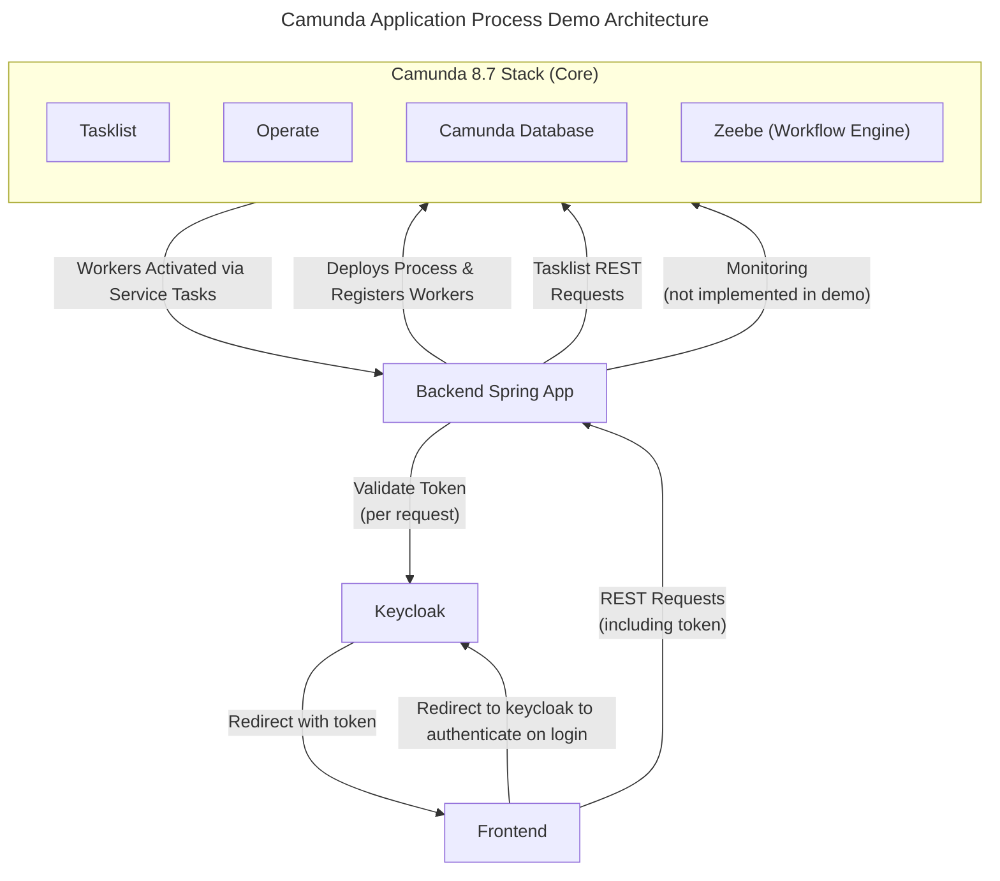

```mermaid
---
title: Camunda Application Process Demo Architecture
---
flowchart
    subgraph camunda["Camunda 8.7 Stack (Core)"]
        direction TB
        tasklist["Tasklist"]
        operate["Operate"]
        camunda_database["Camunda Database"]
        zeebe["Zeebe (Workflow Engine)"]
    end
    backend["Backend Spring App"]
    frontend["Frontend"]
    keycloak["Keycloak"]
    camunda--->|Workers Activated via Service Tasks|backend
    backend--->|Deploys Process & Registers Workers|camunda
    backend--->|Tasklist REST<br>Requests|camunda
    backend--->|"Monitoring<br>(not implemented in demo)"|camunda
    backend--->|"Validate Token<br>(per request)"|keycloak
    frontend-->|"Redirect to keycloak to authenticate on login"|keycloak
    keycloak--->|Redirect with token|frontend
    frontend-->|"REST Requests<br>(including token)"|backend
```